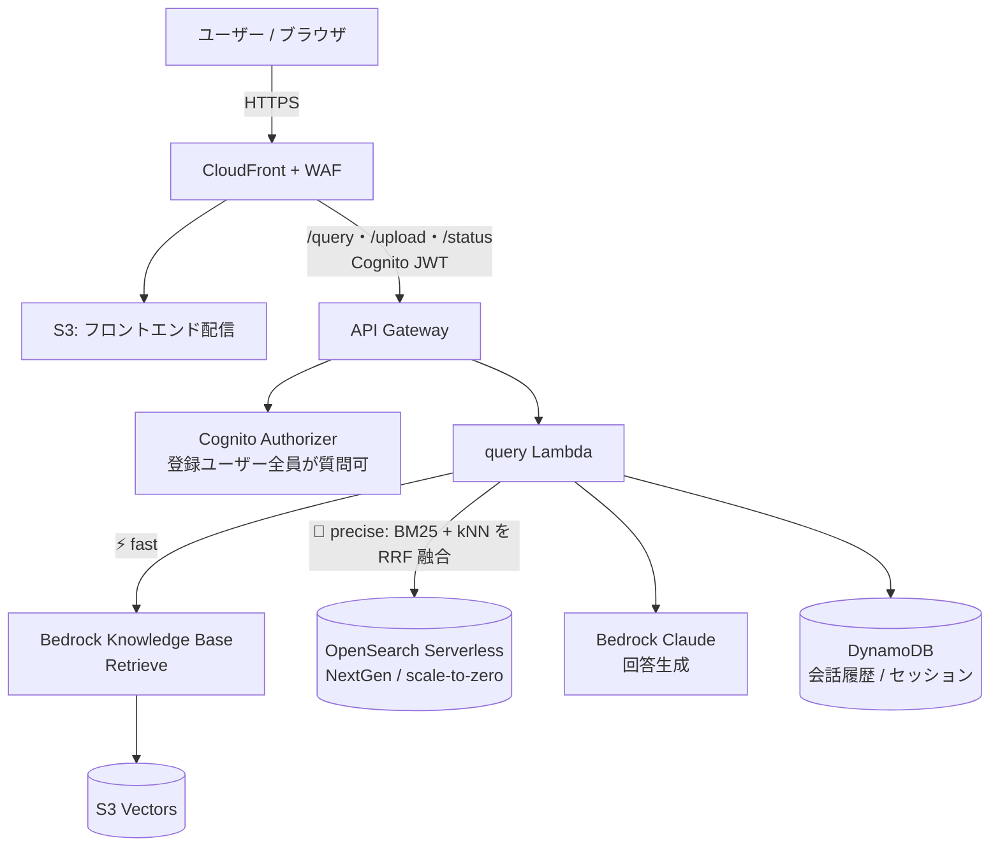
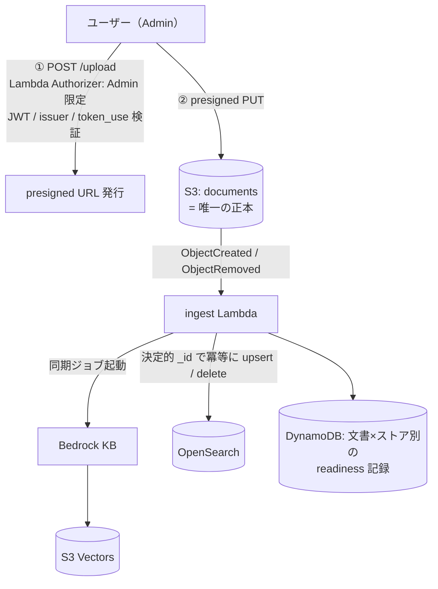

# RAG Document QA System

PDF をアップロードして内容を自然言語で質問できる、**フルサーバーレス RAG アプリケーション**。
ワークロード全体を **IaC（Terraform）** で構築し、GitHub Actions（OIDC）でデプロイします。
（マルチアカウント統制基盤——Organizations / SCP / SSO——は構築済み・IaC 化はロードマップ）

> このリポジトリは「完成品」だけでなく、**設計判断とトレードオフの過程**を見せることを目的としています。
> 各セクションの「なぜそうしたか」が本体です。

## ハイライト

- ⚡🎯 **ベクトルストア二刀流（dual store）**：S3 Vectors（常時即応の fast）と OpenSearch Serverless NextGen（ハイブリッド検索の高精度）を同時運用。**scale-to-zero だから両方持ってもアイドル増分は月数百円**
- 🔌 **ネットワーク隔離のダイヤル化**：PrivateLink（VPC エンドポイント）構成を Terraform フラグ 1 つで ON/OFF。**「常時の固定費」ではなく「必要な日だけ点ける時間課金」**として運用
- 🧪 **構成マトリクスの実機検証**：`vector_store × network` の組合せを、TFVARS を変えずに CI の dispatch 入力だけで切替（**6 組合せ中 5 を実機検証済**・dual×PrivateLink は設計上対応）
- 🔐 **全データストアを CMK（カスタマー管理キー）で暗号化**・ローテーション有効。あえて「E2E 暗号化」とは呼ばない整理込み
- 🏢 **マルチアカウント**（AWS Organizations / SCP / SSO / 組織 CloudTrail）＋ 環境差分は **tfvars のみ**
- 👥 **役割で分けた認可**：文書のアップロードは Admin グループのみ（Lambda authorizer）・質問は登録ユーザー全員（Cognito authorizer）——エンドポイント単位で認可方式を使い分け

## アーキテクチャ

### 質問フロー（二刀流）



- **フロントも API も CloudFront（+ WAF）配下の単一ドメイン**：API（`/query`・`/upload`・`/status`）も CloudFront 経由で API Gateway へ。WAF が API もカバーし、同一オリジンのため CORS 不要（S3 への presigned 直 PUT のみ別オリジン）
- `mode=precise` がコールド（暖機中）のときは **fast へ自動フォールバック**し、使用モードを正直に返します
- Cognito の **Post-Authentication トリガ**がログイン時に OpenSearch を暖機（cold-start 対策をユーザー操作時間で吸収）

### 取り込みフロー（正本 1 つ・派生インデックス 2 つ）



- 二重書き込みは「**正本 S3 ＋ 冪等に再生成できる派生インデックスへの fan-out**」として設計
  （upsert・削除伝播・ストア別 readiness・経路ごとの分離エラー処理の 4 点で整合を担保）

## 主要な設計判断とトレードオフ

| 判断 | 採用 | 不採用と理由 |
|---|---|---|
| 統制基盤 | **Organizations 直接**（OU / SCP / 組織 CloudTrail） | Control Tower：固定 3 環境で量産しない・Config 自動課金・decommission が不可逆。実務なら第一選択であることを理解した上での文脈判断 |
| ベクトルストア | **二刀流**（fast=S3 Vectors / 高精度=OpenSearch ハイブリッド） | 単独運用：scale-to-zero によりアイドル増分がほぼゼロのため、速度と精度を「選ばせる」UX が成立 |
| cold-start 対策 | **ログイン起点ウォーマー**（Post-Auth トリガ）＋ フォールバック | 定期ウォーマー：常時コストが scale-to-zero の利点を殺す |
| ネットワーク隔離 | **フラグでダイヤル化**（6 組合せ中 5 を実機検証済） | 常時 ON：脅威モデル上、通信は TLS+IAM で保護済み。追加保証に常時固定費を払う要件がない |
| state 分離 | **見送り**（versioning / PITR ＋ prod は prevent_destroy・削除保護で正本保護） | naive な分割はモジュール間の循環依存で不成立と分析。守る対象は正本のみ（派生は再生成可能） |
| 監査ログ | **組織 trail に一本化** | per-env trail：組織 trail と記録範囲が 100% 重複し、管理イベントの「2 コピー目」として課金される（Cost Explorer で実測確認）。アカウント内の即時参照はクロスアカウント参照で代替 |
| tfstate | **アカウントごとに分離**＋ S3 ネイティブロック（use_lockfile） | 集中管理：クロスアカウントアクセスが増え、隔離の趣旨に反する |
| E2E 暗号化という表現 | **使わない**（転送時 + 保存時 CMK + 経路私設化 + IAM の多層防御と説明） | RAG は埋め込み生成等でサービスが平文を扱うため、E2EE は定義上成立しない |

## テスト戦略（4 層）

「動く」だけでなく「壊れたら気づける」ことを、層ごとに手段を分けて担保します。

| 層 | 手段 | 何を守るか |
|---|---|---|
| ロジックの不変条件 | **pytest 単体テスト**（`tests/`・CI で自動実行） | user_id の fail-closed・RRF 融合・決定的 _id・取り込みジョブの status フィルタ・認可（token_use / グループ / ワイルドカード化） |
| AWS 統合 | 単体テスト内で **moto / monkeypatch** でモック | DynamoDB readiness 判定・presigned 検証など、AWS を実際に叩かず決定的に |
| 構成マトリクス | **実機 E2E**（下表・CI dispatch で TFVARS 無改変のまま切替） | `vector_store × network` の組合せが実環境で疎通すること |
| RAG 回答品質 | 手動の対比検証（⚡ fast / 🎯 precise） | 検索方式による回答の網羅性の差 |

単体テストは AWS クレデンシャル不要（OIDC 権限も付与しない独立ジョブ）で、`lambda/**` 変更時に走ります。

## 検証マトリクス（CI の dispatch 入力で TFVARS 無改変のまま切替）

「実機検証済」＝アップロード→索引化→検索→回答生成までを実環境で通したことを指します。

| | network OFF（既定） | network ON（PrivateLink） |
|---|---|---|
| s3_vectors | ✅ 実機検証済 | ✅ 実機検証済 |
| opensearch | ✅ 実機検証済 | ✅ 実機検証済（NextGen は **標準 `aoss-data` エンドポイント**が必要——managed VPCE は Classic 専用） |
| dual | ✅ 実機検証済（**3環境の既定構成**） | 設計上対応（EP はストア連動で必要分のみ作成） |

## コスト（東京リージョン・小規模利用・Cost Explorer 実測で検証）

| 構成 | 月額目安 |
|---|---|
| 1 環境（dual × network OFF） | **約 $10〜14**（支配項は WAF ≈$5 ＋ CMK×3 ≈$3 の固定費。ベクトルストアは誤差） |
| 二刀流のアイドル増分 | **約 $2〜4**（aoss 用 CMK $1 ＋ 使った時間分の OCU $1〜3 のみ） |
| ネットワーク隔離 ON | **+$2〜3 / 日**（Interface EP は時間課金。使う日だけ点灯） |

- 数字は見積もりでなく **Cost Explorer の実測**で検証（支配項が WAF であること、ベクトルストア 2 系統が誤差レベルであることを確認）
- 実測中に **per-env CloudTrail が組織 trail の「2 コピー目」として課金されている**ことを特定し、一本化で **3 環境計 約 $9〜12/月を削減**（設計判断テーブル「監査ログ」参照）

## 技術スタック

**AWS**: Lambda (Python 3.13) / API Gateway / Cognito / S3 / CloudFront + WAF / Bedrock (Claude, Titan Embeddings, Knowledge Bases) / S3 Vectors / OpenSearch Serverless NextGen / DynamoDB / KMS / SQS / CloudWatch / X-Ray / Organizations / IAM Identity Center
**IaC / CI**: Terraform（モジュールは [別リポジトリ](https://github.com/Yuki670926/rag-portfolio-modules) で per-module セマンティックタグ管理）/ GitHub Actions（OIDC・plan ゲート・環境別 concurrency）

## リポジトリ構成

```
terraform/        # ルートモジュール（環境差分は environments/*.tfvars のみ）
lambda/           # ingest / query / presigned_url / authorizer / postauth
frontend/         # 単一 HTML の SPA（モードトグル・進捗表示・readiness polling）
layers/           # Lambda レイヤー（requirements.lock による再現可能ビルド）
scripts/          # Docker ベースのレイヤービルド
.github/workflows # tf-plan(PR) / tf-apply(dispatch・store/network 上書き入力) / deploy-frontend
```

## デプロイ（概要）

1. 環境ごとの tfstate バケットと Secrets Manager（Cognito 初期パスワード / 通知メール）を用意
2. `terraform/environments/<env>.tfvars` と `<env>-backend.hcl` を作成
3. 初回のみローカル `terraform apply`（CI 用 OIDC ロール自体を作るため）
4. GitHub Environment（dev / stag / prod）に secrets を登録：`AWS_ROLE_ARN`・`TFVARS`（Terraform 用）、`FRONTEND_DEPLOY_ROLE_ARN`・`FRONTEND_BUCKET`・`CF_DISTRIBUTION_ID`（フロント配信用）
5. 以降は GitHub Actions：`tf-apply.yml` を dispatch（`command=plan` → 差分確認 → `apply`。prod は required reviewer の承認ゲート付き）

### 運用ノート

- dispatch の `vector_store` / `private_networking` 上書きは**一時検証用**。`-var` は TFVARS より優先されるため、override で apply した後は必ず keep で plan → apply して TFVARS の状態へ復帰させる（戻さないと次の keep apply で**無言で巻き戻る**）
- デプロイ系 workflow（tf-apply / tf-plan / deploy-frontend）は環境ごとに単一の concurrency グループで直列化している。**複数の run が同時に待機すると、古い待機 run は GitHub によりキャンセルされる**（フロント自動配信が消えた場合は dispatch で再実行）

---

### 開発の記録について

本プロジェクトでは、実装中に遭遇した問題（API Gateway authorizer のキャッシュ粒度、OpenSearch Serverless の eventual consistency、NextGen の VPC エンドポイント仕様、CI と IaC の二重管理衝突など）を**すべて根本原因まで切り分けて修正**しています。それらの知見は順次、技術記事として公開予定です。
