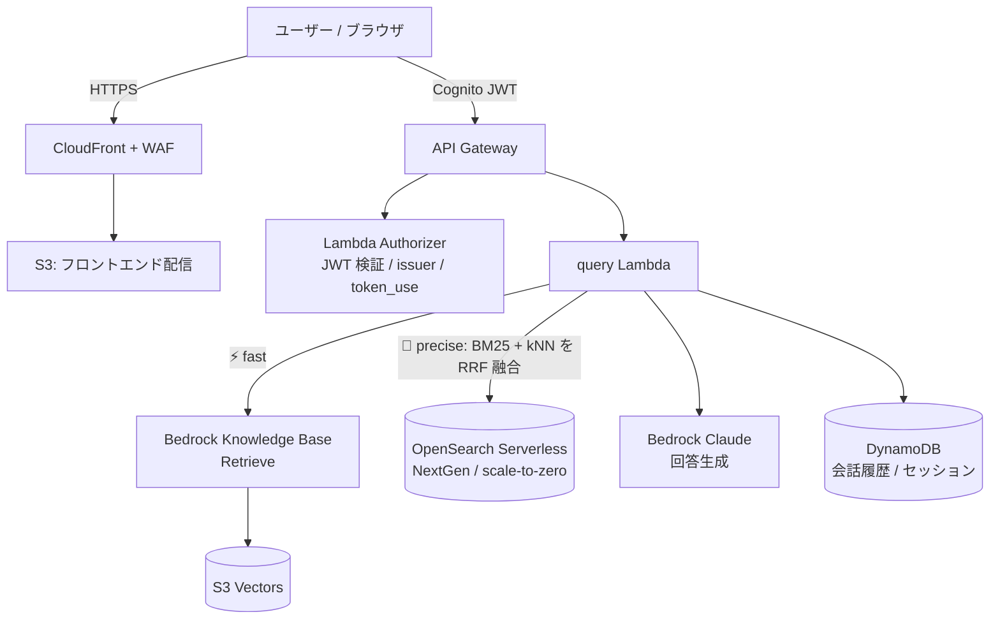
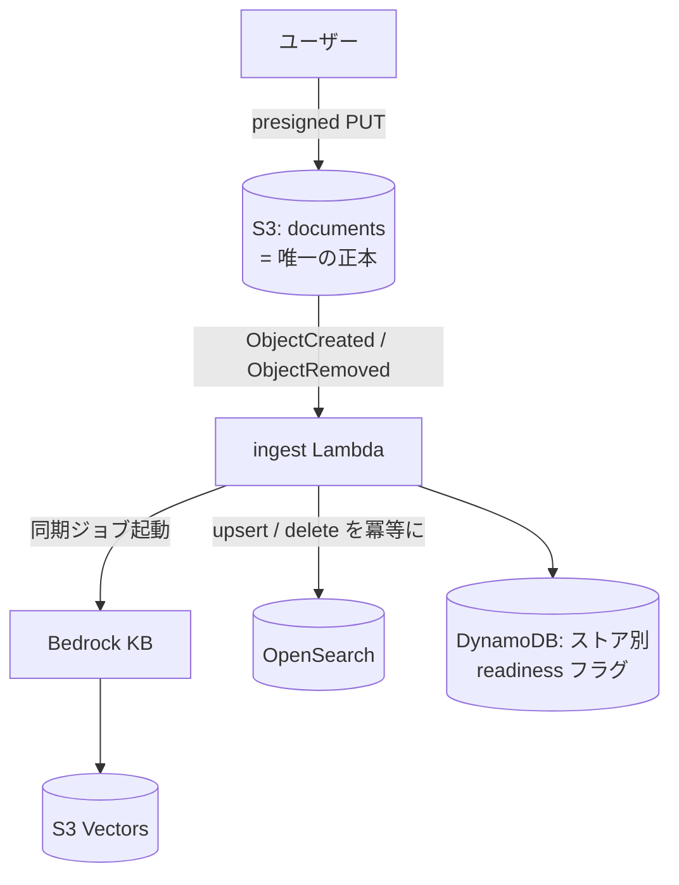

# RAG Document QA System

PDF をアップロードして内容を自然言語で質問できる、**フルサーバーレス RAG アプリケーション**。
AWS 上に **100% IaC（Terraform）** で構築し、GitHub Actions（OIDC）でデプロイします。

> このリポジトリは「完成品」だけでなく、**設計判断とトレードオフの過程**を見せることを目的としています。
> 各セクションの「なぜそうしたか」が本体です。

## ハイライト

- ⚡🎯 **ベクトルストア二刀流（dual store）**：S3 Vectors（常時即応の fast）と OpenSearch Serverless NextGen（ハイブリッド検索の高精度）を同時運用。**scale-to-zero だから両方持ってもアイドル増分は月数百円**
- 🔌 **ネットワーク隔離のダイヤル化**：PrivateLink（VPC エンドポイント）構成を Terraform フラグ 1 つで ON/OFF。**「常時の固定費」ではなく「必要な日だけ点ける時間課金」**として運用
- 🧪 **構成マトリクスの実機検証**：`vector_store × network` の全組合せを、TFVARS を変えずに CI の dispatch 入力だけで切替・E2E 検証
- 🔐 **全データストアを CMK（カスタマー管理キー）で暗号化**・ローテーション有効。あえて「E2E 暗号化」とは呼ばない整理込み
- 🏢 **マルチアカウント**（AWS Organizations / SCP / SSO / 組織 CloudTrail）＋ 環境差分は **tfvars のみ**

## アーキテクチャ

### 質問フロー（二刀流）



- `mode=precise` がコールド（暖機中）のときは **fast へ自動フォールバック**し、使用モードを正直に返します
- Cognito の **Post-Authentication トリガ**がログイン時に OpenSearch を暖機（cold-start 対策をユーザー操作時間で吸収）

### 取り込みフロー（正本 1 つ・派生インデックス 2 つ）



- 二重書き込みは「**正本 S3 ＋ 冪等に再生成できる派生インデックスへの fan-out**」として設計
  （upsert・削除伝播・ストア別 readiness・経路ごとの分離エラー処理の 4 点で整合を担保）

## 主要な設計判断とトレードオフ

| 判断 | 採用 | 不採用と理由 |
|---|---|---|
| 統制基盤 | **Organizations 直接**（OU / SCP / 組織 CloudTrail） | Control Tower：固定 3 環境で量産しない・Config 自動課金・decommission が不可逆。実務なら第一選択であることを理解した上での文脈判断 |
| ベクトルストア | **二刀流**（fast=S3 Vectors / 高精度=OpenSearch ハイブリッド） | 単独運用：scale-to-zero によりアイドル増分がほぼゼロのため、速度と精度を「選ばせる」UX が成立 |
| cold-start 対策 | **ログイン起点ウォーマー**（Post-Auth トリガ）＋ フォールバック | 定期ウォーマー：常時コストが scale-to-zero の利点を殺す |
| ネットワーク隔離 | **フラグでダイヤル化**（全組合せ実機検証済） | 常時 ON：脅威モデル上、通信は TLS+IAM で保護済み。追加保証に常時固定費を払う要件がない |
| state 分離 | **見送り**（versioning / PITR / prevent_destroy で正本保護） | naive な分割はモジュール間の循環依存で不成立と分析。守る対象は正本のみ（派生は再生成可能） |
| tfstate | **アカウントごとに分離**＋ S3 ネイティブロック（use_lockfile） | 集中管理：クロスアカウントアクセスが増え、隔離の趣旨に反する |
| E2E 暗号化という表現 | **使わない**（転送時 + 保存時 CMK + 経路私設化 + IAM の多層防御と説明） | RAG は埋め込み生成等でサービスが平文を扱うため、E2EE は定義上成立しない |

## 検証マトリクス（CI の dispatch 入力で TFVARS 無改変のまま切替）

| | network OFF（既定） | network ON（PrivateLink） |
|---|---|---|
| s3_vectors | ✅ E2E | ✅ E2E |
| opensearch | ✅ E2E | ✅ E2E（NextGen は **標準 `aoss-data` エンドポイント**が必要——managed VPCE は Classic 専用） |
| dual | ✅ E2E（既定構成） | 設計上対応（EP はストア連動で必要分のみ作成） |

## コスト（東京リージョン・小規模利用）

| 構成 | 月額目安 |
|---|---|
| 1 環境（dual × network OFF） | **約 $13〜17**（支配項は WAF + KMS の固定費。ベクトルストアは誤差） |
| 二刀流のアイドル増分 | **約 $2〜4**（aoss 用 CMK + 使った時間の OCU のみ） |
| ネットワーク隔離 ON | **+$2〜3 / 日**（Interface EP は時間課金。使う日だけ点灯） |

## 技術スタック

**AWS**: Lambda (Python 3.13) / API Gateway / Cognito / S3 / CloudFront + WAF / Bedrock (Claude, Titan Embeddings, Knowledge Bases) / S3 Vectors / OpenSearch Serverless NextGen / DynamoDB / KMS / SQS / CloudWatch / X-Ray / Organizations / IAM Identity Center
**IaC / CI**: Terraform（モジュールは [別リポジトリ](https://github.com/Yuki670926/rag-portfolio-modules) で per-module セマンティックタグ管理）/ GitHub Actions（OIDC・plan ゲート・環境別 concurrency）

## リポジトリ構成

```
terraform/        # ルートモジュール（環境差分は environments/*.tfvars のみ）
lambda/           # ingest / query / presigned_url / authorizer / postauth
frontend/         # 単一 HTML の SPA（モードトグル・進捗表示・readiness polling）
layers/           # Lambda レイヤー（requirements.lock による再現可能ビルド）
scripts/          # Docker ベースのレイヤービルド
.github/workflows # tf-plan(PR) / tf-apply(dispatch・store/network 上書き入力) / deploy-frontend
```

## デプロイ（概要）

1. 環境ごとの tfstate バケットと Secrets Manager（Cognito 初期パスワード / 通知メール）を用意
2. `terraform/environments/<env>.tfvars` と `<env>-backend.hcl` を作成
3. 初回のみローカル `terraform apply`（CI 用 OIDC ロール自体を作るため）
4. 以降は GitHub Actions：`tf-apply.yml` を dispatch（`command=plan` → 差分確認 → `apply`）

---

### 開発の記録について

本プロジェクトでは、実装中に遭遇した問題（API Gateway authorizer のキャッシュ粒度、OpenSearch Serverless の eventual consistency、NextGen の VPC エンドポイント仕様、CI と IaC の二重管理衝突など）を**すべて根本原因まで切り分けて修正**しています。それらの知見は順次、技術記事として公開予定です。
